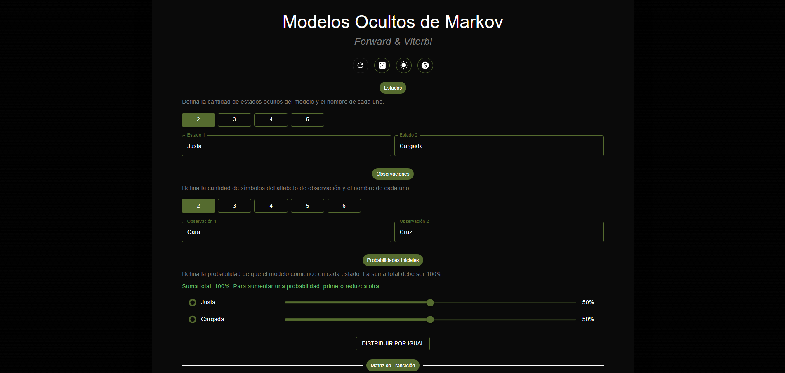
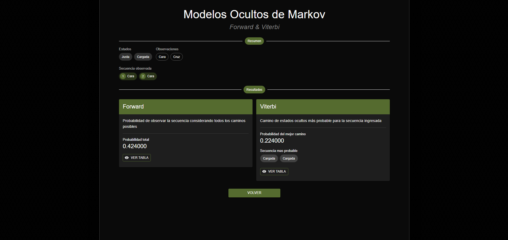

# 🧬 Simulador de Modelos Ocultos de Markov

Proyecto académico desarrollado como trabajo final de la materia **Bioinformática**, consistente en una aplicación web interactiva para configurar, visualizar y analizar **Modelos Ocultos de Markov (HMM)** mediante la ejecución de los algoritmos **Forward** y **Viterbi**.

La aplicación permite construir modelos personalizados, ejecutar ambos algoritmos y visualizar los resultados obtenidos.

---

## 📄 Descripción

La aplicación permite configurar completamente un **Modelo Oculto de Markov (HMM)** de forma interactiva, definiendo:

- Entre 2 y 5 estados ocultos
- Entre 2 y 6 observaciones
- Probabilidades iniciales
- Matriz de transición
- Matriz de emisión
- Secuencia de observaciones

Una vez validado el modelo, se ejecutan simultáneamente los algoritmos **Forward** y **Viterbi**, mostrando:

- La probabilidad total de la secuencia observada (Forward)
- La secuencia de estados más probable (Viterbi)
- Las tablas de cálculo generadas por ambos algoritmos

Además, la aplicación incluye algunos ejemplos precargados, un sistema de validación del modelo antes de realizar los cálculos y una interfaz completamente responsive.

---

## 🛠️ Tecnologías utilizadas

### Frontend

- **React (Vite)**
- **TypeScript**
- **Material UI (MUI)**

### Algoritmos implementados

- **Forward**
- **Viterbi**

El proyecto fue desarrollado sin utilizar librerías específicas para HMM, implementando ambos algoritmos desde cero.

---

## 📷 Preview

Algunas capturas representativas de la aplicación:

### Configuración del modelo

### Resultados

